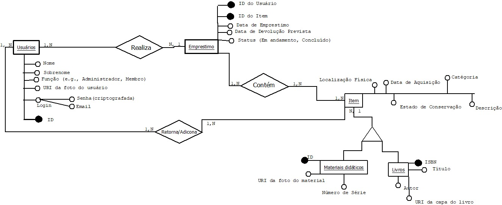
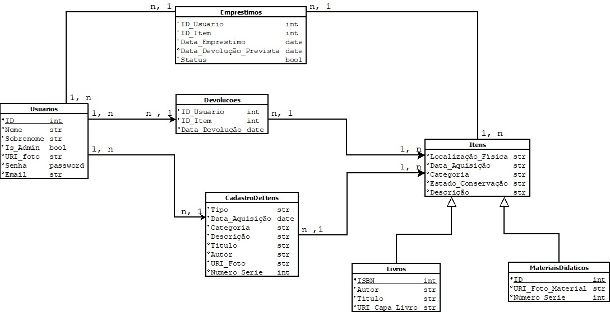
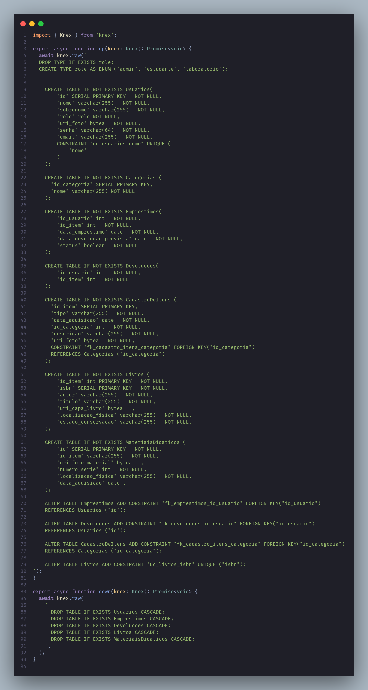
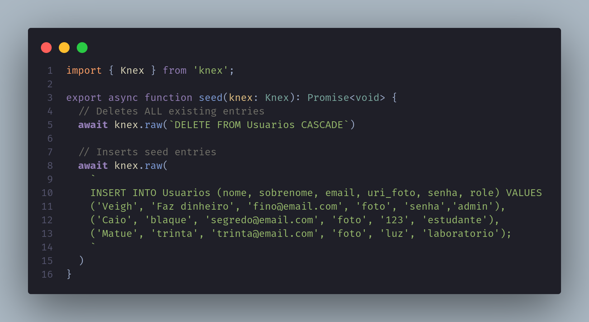
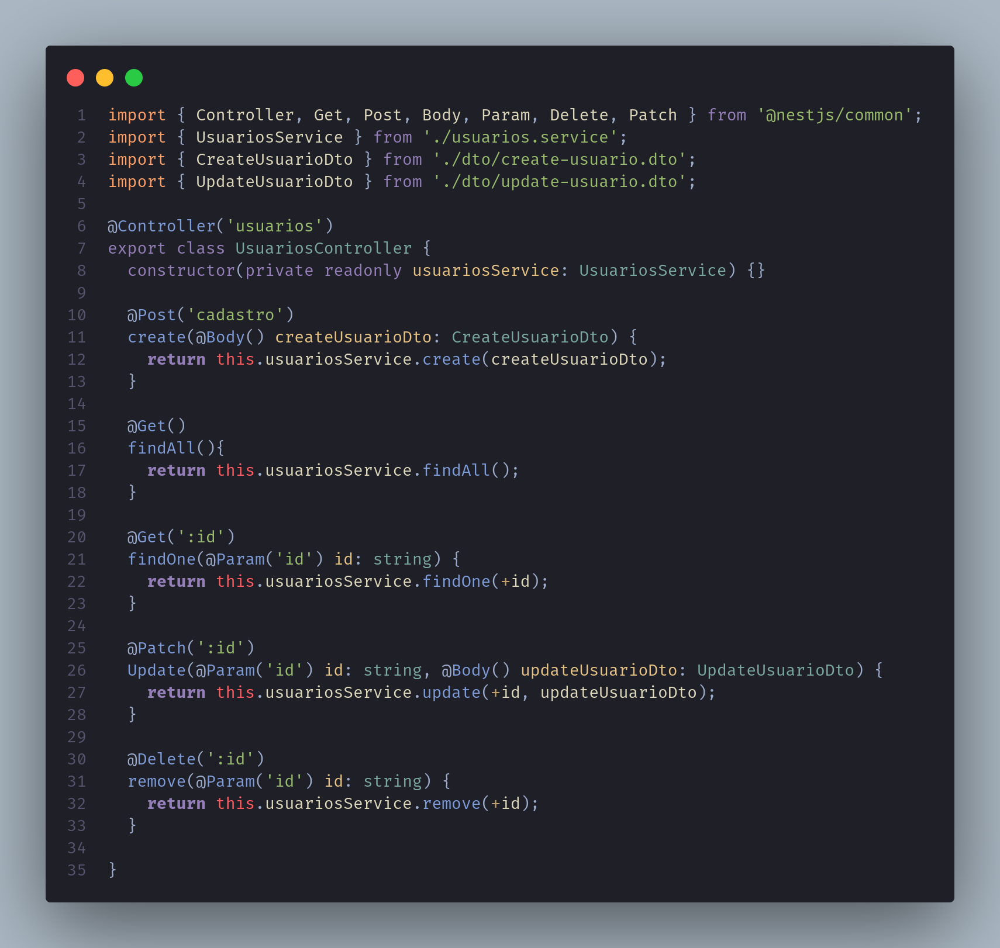

<div align="center">

</div>

# Projeto prático de Banco de Dados

## Grupo: 1

## Autores:

- Gustavo Barbosa de Almeida - 202037589
- Ana Beatriz - 180012428
- Lucas da Silva - 180125699
- Hideki Tomiyama - 190014351
- Thiago Silva Ribeiro - 202037702

## CRediT (Contributor Roles Taxonomy):

- **Gustavo** configuração do docker, configuração do backend e documentação dos mesmos, configuração e instalação do frontend, autenticação e gerenciamento de rotas e permissões.
- **Lucas** criação do repositório, instalação do nvm e do nodejs, e documentação do mesmo.
- **Ana Beatriz** instalação do postgresql e configuração do mesmo.
- **Thiago** criação do modelo de banco de dados e documentação do mesmo, criação dos CRUDS e teste de rotas.
- **Hideki** criação dos scripts SQL e documentação dos mesmos.

## Data da Versão Atual: 30/11/2023

---

# Sistema de Gerenciamento de Materiais para um Laboratório Didático

## Descrição

Para auxiliar os estudantes e professores, o seu grupo ficou encarregado de elaborar um sistema de informação para gerenciar livros de ensino e materiais didáticos em um laboratório. O sistema será projetado para organizar e disponibilizar esses recursos para empréstimo através de um sistema computacional.

O foco principal desta especificação é a definição do banco de dados que será utilizado para armazenar informações sobre os livros e materiais. O sistema deve ter diferentes níveis de acesso para os usuários (por exemplo, administradores do sistema computacional, membros do laboratório e estudantes em geral), de maneira que todos os usuários possam pesquisar os livros e materiais, mas apenas membros do laboratório possam pegar os materiais emprestados.

## Tecnologias Utilizadas

[NestJS](https://nestjs.com/)

- O NestJS é um framework de desenvolvimento back-end para Node.js que utiliza TypeScript e segue o padrão arquitetural do Angular. Ele oferece uma estrutura robusta e modular para criar aplicativos escaláveis e bem organizados.

[Next.js](https://nextjs.org/)

- O Next.js é um framework de desenvolvimento front-end para React que simplifica a construção de aplicativos React universais. Ele oferece recursos como renderização do lado do servidor, roteamento simples e pré-renderização, tornando-o adequado para aplicativos da web modernos.

[Knex.js](http://knexjs.org/)

- O Knex.js é um construtor de consultas SQL para Node.js. Ele facilita a interação com bancos de dados relacionais, permitindo a criação de consultas de forma programática e intuitiva. É uma escolha popular para lidar com operações de banco de dados em aplicativos Node.js.

[Node.js](https://nodejs.org/)

- O Node.js é um ambiente de tempo de execução JavaScript que permite que você execute código JavaScript do lado do servidor. Ele é amplamente usado para construir aplicativos de servidor escaláveis e em tempo real, graças ao seu modelo de E/S não bloqueante.

[PostgreSQL](https://www.postgresql.org/)

- O PostgreSQL é um sistema de gerenciamento de banco de dados relacional de código aberto. Ele é conhecido por sua confiabilidade, recursos avançados e extensibilidade. O PostgreSQL é uma escolha popular para aplicativos que requerem um banco de dados robusto e escalável.

## Sistema operacional

O sistema operacional utilizado pela maioria da equipe será linux.

# 1 Documentação de Configuração de Ambiente e Tecnologias

Esta documentação descreve os passos necessários para configurar o ambiente de desenvolvimento e lista as tecnologias utilizadas neste projeto.

## Configuração de Ambiente

### 1. Instalação do NVM (Node Version Manager) e Node.js (Linux)

Antes de começar, é importante garantir que o sistema esteja atualizado.

```bash
sudo apt update
sudo apt upgrade
```

#### 1.1. Instalação do NVM

Você pode escolher entre dois métodos para instalar o NVM: usando curl ou wget. Escolha um dos seguintes comandos:

```bash
## Usando curl
curl -o- https://raw.githubusercontent.com/nvm-sh/nvm/v0.39.5/install.sh | bash
```

```bash
## Ou usando wget
wget -qO- https://raw.githubusercontent.com/nvm-sh/nvm/v0.39.5/install.sh | bash
```

Após a instalação, feche e reabra o terminal. Para verificar a instalação do NVM:

```bash
nvm --version
```

#### 1.2. Instalação do Node.js

Com o NVM instalado, você pode instalar o Node.js. Recomendamos a instalação da versão LTS mais recente:

```bash
nvm install --lts
```

Para verificar a versão do Node.js:

```bash
node --version
```

## 2. Instalação do PostgreSQL (Sistema de Gerenciamento de Banco de Dados)

Para instalar o PostgreSQL no Linux, execute o seguinte comando:

```bash
sudo apt install postgresql postgresql-contrib libpq-dev
```

Para verificar a instalação do PostgreSQL:

```bash
pg_config --version
```

#### 2.1. Guia de Uso do Docker com PostgreSQL (Opcional)

Se preferir usar o Docker com o PostgreSQL, siga as instruções em Guia de Uso do Docker com PostgreSQL para configuração e uso do contêiner PostgreSQL.

#### Pré-requisitos

- [Docker](https://www.docker.com/get-started/) instalado em seu sistema.
- [Docker Compose](https://docs.docker.com/compose/install/) (geralmente incluído com a instalação do Docker).

#### Configuração do Docker Compose

No diretório do projeto, verifique se existe um arquivo docker-compose.yml. Este arquivo contém as configurações necessárias para criar o contêiner PostgreSQL.

#### Iniciar o Banco de Dados PostgreSQL

Abra um terminal e navegue até o diretório do projeto onde está o arquivo docker-compose.yml.

- _Para iniciar o contêiner PostgreSQL, execute o seguinte comando:_

```bash
docker-compose up -d
```

Isso criará e iniciará o contêiner PostgreSQL em segundo plano (-d).
Aguarde até que o contêiner esteja em execução.

- _Você pode verificar o status do contêiner com o seguinte comando:_

```bash
docker ps
```

Certifique-se de que o contêiner PostgreSQL esteja listado na saída.

#### Conectar-se ao Banco de Dados PostgreSQL

Para se conectar ao banco de dados PostgreSQL a partir do terminal, use o seguinte comando:

```bash
psql -h localhost -U postgres -d db
```

- `-h` localhost: Especifica o host onde o PostgreSQL está sendo executado (local).
- `-U` postgres: Especifica o nome de usuário (geralmente é "postgres" por padrão).
- `-d` db: Especifica o nome do banco de dados ao qual você deseja se conectar.
- Será solicitada a senha do usuário "postgres". Insira a senha configurada no arquivo docker-compose.yml (por padrão, é "postgres").

Você estará conectado ao banco de dados PostgreSQL e poderá executar comandos SQL.

#### Encerrar o Contêiner

Quando você terminar de trabalhar com o banco de dados, você pode parar e remover o contêiner PostgreSQL usando o seguinte comando:

```bash
docker-compose down
```

Isso desligará e removerá o contêiner PostgreSQL. Certifique-se de que nenhum dado importante seja perdido antes de executar este comando.

## Tecnologias Utilizadas

### 1. Frontend com Next.js

Para executar o frontend do projeto com Next.js, siga os passos abaixo:

Instale as dependências:

```bash
npm install
```

Inicie o servidor de desenvolvimento:

```bash
npm run dev
```

### 2. Backend com NestJS

Para executar o backend do projeto com NestJS, siga os passos abaixo:

Instale as dependências:

```bash
npm install
```

Inicie a aplicação no modo de desenvolvimento:

```bash
npm run start
```

## 3. Modelo de Banco de Dados

Um Modelo de Banco de Dados é essencial em projetos, definindo a estrutura e organização dos dados, garantindo eficiência, integridade e escalabilidade. É a base para a gestão de informações eficaz.

### 3.1. Diagramas de entidade-relacionamento (DERs)

Diagramas de Entidade-Relacionamento (DERs) são representações visuais que descrevem a estrutura de um banco de dados, mostrando entidades, atributos e relacionamentos entre eles.

<div align="center">

</div>

### 3.2 Diagrama do Modelo Lógico (Relacional)

Um Diagrama do Modelo Lógico Relacional é uma representação visual que descreve as tabelas de um banco de dados relacional, seus campos, chaves primárias e chaves estrangeiras. Tabelas representam entidades, campos representam atributos, chaves primárias garantem unicidade e identificação única de registros, e chaves estrangeiras estabelecem relações entre tabelas. Sua importância reside na definição clara da estrutura do banco de dados, permitindo o armazenamento eficiente e a recuperação de informações, garantindo integridade de dados e facilitando o desenvolvimento de consultas e relatórios. Além disso, o modelo lógico serve como guia para a implementação física do banco de dados.

<div align="center">

</div>

## 4. Scripts SQL
### Criação de tabelas

#### Tabela Usuários
```sql
CREATE TABLE "Usuarios"(
    "id" int   NOT NULL,
    "nome" varchar(255)   NOT NULL,
    "sobrenome" varchar(255)   NOT NULL,
    "is_admin" boolean   NOT NULL,
    "uri_foto" varchar(255)   NOT NULL,
    "senha" varchar(64)   NOT NULL,
    "email" varchar(255)   NOT NULL,
    CONSTRAINT "pk_usuarios" PRIMARY KEY (
        "id"
     ),
    CONSTRAINT "uc_usuarios_nome" UNIQUE (
        "nome"
    )
);
```

#### Tabela Emprestimos
```sql
CREATE TABLE "Emprestimos"(
    "id_usuario" int   NOT NULL,
    "id_item" int   NOT NULL,
    "data_emprestimo" date   NOT NULL,
    "data_devolucao_prevista" date   NOT NULL,
    "status" boolean   NOT NULL
);
```

#### Tabela Devoluções
```sql
CREATE TABLE "Devolucoes"(
    "id_usuario" int   NOT NULL,
    "id_item" int   NOT NULL
);
```

#### Tabela CadastroDeItens
```sql
CREATE TABLE "CadastroDeItens" (
    "id_item" int   NOT NULL,
    "tipo" varchar(255)   NOT NULL,
    "data_aquisicao" date   NOT NULL,
    "categoria" varchar(255)   NOT NULL,
    "descricao" varchar(255)   NOT NULL,
    "titulo" varchar(255)   NOT NULL,
    "autor" varchar(255)   NOT NULL,
    "uri_foto" varchar(255)   NOT NULL,
    "numero_serie" int   NOT NULL
);
```

#### Tabela Itens
```sql
CREATE TABLE "Itens" (
    "id" int   NOT NULL,
    "id_material" int   NOT NULL,
    "id_isbn" int   NOT NULL,
    "localizacao_fisica" varchar(255)   NOT NULL,
    "data_aquisicao" date   NOT NULL,
    "categoria" varchar(255)   NOT NULL,
    "estado_conservacao" varchar(255)   NOT NULL,
    "descricao" varchar(255)   NOT NULL,
    CONSTRAINT "pk_itens" PRIMARY KEY (
        "id"
     )
);
```

#### Tabela Livros
```sql
CREATE TABLE "Livros" (
    "ISBN" int   NOT NULL,
    "autor" varchar(255)   NOT NULL,
    "titulo" varchar(255)   NOT NULL,
    "uri_capa_livro" varchar(255)   NOT NULL,
    CONSTRAINT "pk_livros" PRIMARY KEY (
        "ISBN"
     )
);
```

#### Tabela MateriaisDidáticos
```sql
CREATE TABLE "MateriaisDidaticos" (
    "id" int   NOT NULL,
    "uri_foto_material" varchar(255)   NOT NULL,
    "numero_serie" int   NOT NULL,
    CONSTRAINT "pk_materiaisDidadicos" PRIMARY KEY (
        "id"
     )
);
```

### Chaves estrangeiras
```sql
ALTER TABLE "Emprestimos" ADD CONSTRAINT "fk_emprestimos_id_usuario" FOREIGN KEY("id_usuario")
REFERENCES "Usuarios" ("id");

ALTER TABLE "Emprestimos" ADD CONSTRAINT "fk_emprestimos_id_item" FOREIGN KEY("id_item")
REFERENCES "Itens" ("id");

ALTER TABLE "Devolucoes" ADD CONSTRAINT "fk_devolucoes_id_usuario" FOREIGN KEY("id_usuario")
REFERENCES "Usuarios" ("id");

ALTER TABLE "Devolucoes" ADD CONSTRAINT "fk_devolucoes_id_item" FOREIGN KEY("id_item")
REFERENCES "Itens" ("id");

ALTER TABLE "CadastroDeItens" ADD CONSTRAINT "uc_cadastroDeItens_id_item" UNIQUE ("id_item");

ALTER TABLE "Itens" ADD CONSTRAINT "fk_itens_id" FOREIGN KEY("id")
REFERENCES "CadastroDeItens" ("id_item");

ALTER TABLE "Itens" ADD CONSTRAINT "fk_itens_id_material" FOREIGN KEY("id_material")
REFERENCES "MateriaisDidaticos" ("id");

ALTER TABLE "Itens" ADD CONSTRAINT "fk_itens_id_isbn" FOREIGN KEY("id_isbn")
REFERENCES "Livros" ("ISBN");
```

### Inserção de Dados nas tabelas
#### Tabela Usuários
```sql
-- Inserção de dados adicionais na tabela Usuarios
INSERT INTO Usuarios (id, nome, sobrenome, is_admin, uri_foto, senha, email)
VALUES
    (4, 'Usuario3', 'Sobrenome3', false, 'http://urifotousuario3.com', 'hashed_password_usuario3', 'usuario3@example.com'),
    (5, 'Usuario4', 'Sobrenome4', false, 'http://urifotousuario4.com', 'hashed_password_usuario4', 'usuario4@example.com'),
    (6, 'Usuario5', 'Sobrenome5', false, 'http://urifotousuario5.com', 'hashed_password_usuario5', 'usuario5@example.com');
```

#### Tabela Empréstimos
```sql
-- Inserção de dados adicionais na tabela Emprestimos
INSERT INTO Emprestimos (id_usuario, id_item, data_emprestimo, data_devolucao_prevista, status)
VALUES
    (4, 3, '2023-04-04', '2023-05-04', true),
    (5, 1, '2023-04-05', '2023-05-05', false),
    (6, 2, '2023-04-06', '2023-05-06', true);
```

#### Tabela CadastroDeItens
```sql
-- Inserção de dados adicionais na tabela CadastroDeItens
INSERT INTO CadastroDeItens (id_item, tipo, data_aquisicao, categoria, descricao, titulo, autor, uri_foto, numero_serie)
VALUES
    (4, 'Livro', '2023-04-01', 'Suspense', 'Descrição do Livro 3', 'Livro 3', 'Autor 3', 'http://urifotolivro3.com', null),
    (5, 'Material Didático', '2023-04-02', 'Ciência', 'Descrição do Material 2', null, null, 'http://urifotomaterial2.com', 345678),
    (6, 'Livro', '2023-04-03', 'Romance', 'Descrição do Livro 4', 'Livro 4', 'Autor 4', 'http://urifotolivro4.com', null);
```

#### Tabela Itens
```sql
-- Inserção de dados adicionais na tabela Itens
INSERT INTO Itens (id, id_material, id_isbn, localizacao_fisica, data_aquisicao, categoria, estado_conservacao, descricao)
VALUES
    (4, null, 4, 'Estante D', '2023-04-01', 'Suspense', 'Bom', 'Descrição do Livro 3'),
    (5, 4, null, 'Armário E', '2023-04-02', 'Ciência', 'Ótimo', 'Descrição do Material 2'),
    (6, null, 5, 'Estante F', '2023-04-03', 'Romance', 'Regular', 'Descrição do Livro 4');
```

#### Tabela Livros
```sql
-- Inserção de dados adicionais na tabela Livros
INSERT INTO Livros (ISBN, autor, titulo, uri_capa_livro)
VALUES
    (3, 'Autor 3', 'Livro 3', 'http://uricapalivro3.com'),
    (4, 'Autor 4', 'Livro 4', 'http://uricapalivro4.com');
    (5, 'Autor 5', 'Livro 5', 'http://uricapalivro5.com');
```

#### Tabela MateriaisDidáticos
```sql
-- Inserção de dados adicionais na tabela MateriaisDidadicos
INSERT INTO MateriaisDidaticos (id, uri_foto_material, numero_serie)
VALUES
    (3, 'http://urifotomaterial3.com', 567890),
    (4, 'http://urifotomaterial4.com', 123456);
    (5, 'http://urifotomaterial5.com', 234567);

```

Estes scripts SQL fornecem uma visão geral das tabelas criadas, suas relações e exemplos de inserções de dados.

### Criação da camada de persistência.
As tecnologias utilizadas foram **Nestjs** js que é um framework de nodejs e **Knexjs** que é um query builder para SQL, dito isso, os CRUDS foram criados com SQL puro, tanto migrations quanto as seeds também, o knexjs possui um método `knex.raw` que permite colocar queries em SQL puro dentro de um objeto javascript então assim foi feito os CRUDS, Migrations e as Seeds.

##### Exemplos:
**Assim foi feito a migração das tabelas de usuários**
<div align="center">
    
</div>


**E assim foi feito a criação da seed de usuarios**
<div align="center">
    
</div>

#### CRUD de usuários
No controller de usuários que é onde gerenciamos as rotas e recebemos as requisições para darmos alguma resposta pro servidor chamando os métodos criados na service de usuários possui essa estrutura:
<div align="center">
    
</div>

#### Método Create
**Aqui está um exemplo do método create de usuários**
<div>

</div>

Com isso temos uma ideia de como está sendo feito a camada de persistência do sistema, para ter uma visão completa só acessar nosso repositório no [**Github**](https://github.com/lucsap/db-project/tree/main/backend)


**Relatório de Mudança em Tabela de Banco de Dados**

**Mudança Realizada:**
Foi adicionada uma nova tabela chamada Roles ao banco de dados.

**Detalhes da Mudança:**
- **Tabela Anterior:**
    - Nome: Não existia a tabela Roles anteriormente.

- **Nova Tabela (ALTERAÇÃO):**
    - **Nome:** Roles
        - **Campos:**
            - **id:** Número serial, chave primária.
            - **nome:** Texto de até 255 caracteres, não nulo.
        - **Restrições:**
            - Chave única na coluna nome (uc_roles_nome).

Essa mudança visa introduzir uma tabela para armazenar papéis (Roles) no sistema. A tabela possui um identificador único automático (id) e um campo para o nome do papel, garantindo que não haja duplicatas através de uma restrição de chave única.

Para qualquer dúvida ou esclarecimento adicional, favor entrar em contato.


